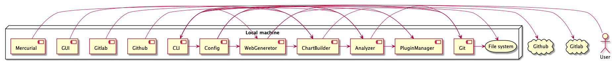

# Visulog

Tool for analysis and visualization of git logs

## Description

Visulog is a data visualisation tool lets you create grahics from a given repository's commit history.


## Running

| Operating System | Command | Notes |
| :----: | :----: | :----: |
| MacOS (Intel) | | |
| MacOS (arm) | | |
| Linux | | |
| Windows | |


## Features

### Analysis

It can give analysis based on:

- number of lines added/deleted/changed
- number of character added/deleted/changed
- number of commits
- number of merge commits

### Visualisation

It can visualise above analysis

- in charts which saved as png files
- on a web server

## Development

### Building the project

From the root of the project run the following command:
```bash
gradle build
```

### Project structure

|              Module              |                                              Description                                              |   Status   |   Version   |
|:--------------------------------:|:-----------------------------------------------------------------------------------------------------:|:----------:|:-----------:|
|      [analyzer](./analyzer)      | Create analysis with given parameters. These analysis are used on `webgen` and `chartbuilder` modules | [RELEASED] |   `0.0.1`   |
|  [charbuilder](./chartbuilder)   |    Contains all logic for building charts which will be saved as `.png` files on the local machine    | [RELEASED] |   `0.0.1`   |
|           [cli](./cli)           |                        Contains the source code of the Command Line Interface                         | [RELEASED] |   `0.0.1`   |
|        [config](./config)        |                      Contains the configuration and the runner for the visulog.                       | [RELEASED] |   `0.0.1`   |
|           [git](./git)           |                                          The adapter for git                                          | [RELEASED] |   `0.0.1`   |
|            [hq](./hq)            |                                         The Mercurial adapter                                         |   [TBD]    |   `0.1.1`   |
|        [github](./github)        |                                      The adapter for Github API                                       |   [TBD]    |   `0.0.2`   |
|        [gitlab](./gitlab)        |                                    The adapter for the Gitlab API                                     |   [TBD]    |   `0.0.3`   |
| [pluginmanager](./pluginmanager) |                                Contains the core types for all plugins                                | [RELEASED] |   `0.0.1`   |
|        [webgen](./webgen)        |              Contains all the logic for web based visualisation of the analysis results               | [RELEASED] |   `0.0.1`   |
|           [gui](./gui)           |                       Contains the source code of the graphical user interface                        |   [TBD]    |   `0.1.2`   |
|  [tablebuilder](./tablebuilder)  |               Contains the source code and logic for building tables to show on stdout                | [RELEASED] |   `0.0.1`   |
|    [csvbuilder](./csvbuilder)    |                      Contains all source code and logic for generating CSV files                      | [RELEASED] |   `0.0.1`   |

#### Internal dependencies



## Roadmap

The feature requests triage is done in three priority levels

### High priority (P1)
Features to implement in next releases

- [ ] Get commit history from a Github remote repository without cloning the entire repository
- [ ] Get commits from a remote repository with ssh without cloning
- [ ] Get commits from a remote repository with http without cloning
- [ ] Introduce a new module called `vcs` which will be parent of `git` and `hq` modules.
- [ ] Solve dependency problem: Modules importing another module can not access to the dependencies of the imported one.
- [ ] Introduce CLI only features

### Medium priority (P2)
Features will be released once all P1 features are implemented

- [ ] Get commit history Gitlab remote repository without cloning the entire repository
- [ ] Graphical user interface (GUI)

### Low priority (P3)
Features to release after P2

- [ ] Add Mercurial support
- [ ] Add Bitbucket support

### Needs triage

Features to define priorities following community needs

- [ ] Add tag support

### Contribution

All contributions are welcome. Please check existing [issues] to find ideas on what to contribute.
If you can not find the issue fits your needs/desires, please create a [new issue] before diving on implementation to discuss about it.


[new issue]: https://github.com/Makepad-fr/visulog/issues/new
[issues]: https://github.com/Makepad-fr/visulog/issues
[RELEASED]: https://github.com/Makepad-fr/releases
[TBD]: ##roadmap
