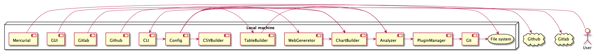

Rapport de projet pré-pro
--- 
Idil Saglam - 22015094

## Présentation
Visulog est un outil qui permet d’analysers l’historique d’un répertoire git. Suite aux analyses il crée des graphiques soit sur la machine locale soit sous forme de fichier HTML que nous pouvons s’en servir pour faire une page web d’analyses. Il permet aussi sauvegarder les graphs générés sous forme d’image (png).

## Analyse des outils existants

Il existe un outil similaire développé en Python qui permet de faire des statistiques sur les répertoires git.
Après les analyses sur ce produit, ses inconvenients que j'ai trouvé sont les suivants:

- Il n'est pas à jour, le dernier mis à jour a été fait il y a deux ans. Donc il n'est pas compatible avec les derniers versions de Python
- Le choix de langage de programmation impacte une baisse de performance.
- Difficulté de portabilité, les programs pythons devrait être exécutés sur des machines avec la bonne version de Python installé. En fonction de la version du Python installé sur la machine le comportement du programme peut varier.

## L'état de l'art

Après l'analyse détaillé des produits existants sur le marché, j'ai donc décidé de développé mon propre produit.
Le programme à développer doit améliorer les points faibles des outils existants. Il doit être donc performante, modulable et portable.

## Architecture du logiciel

Au niveau d'architecture de logiciel, j'ai utilisé domain driven design qui permet d'avoir une couplage faible entre différents modules. Cette couplage faible augmente extensibilité du code ainsi que l'encapsulation des modules.
Le diagram d'architecture de `visulog` est comme suivant:

## Les outils de développement

### Langage de programmation

Comme langage de programmation j'ai utilisé Java (OpenJDK 17).
Ce choix a été effectué en fonction des points suivants :

- **La maturité du langage :** Java est un langage de programmation extrêmement mature et principalement utilisé pour le dévelopement backend.
Il existe plusieurs bibliothèques développée par différents acteurs importants notamment Eclipse et Apache.
- **Paradigme de programmation :** Programmation Orienté Object est une paradigme de programmation qui augmente l'éxtensibilité du programme
- **Performance :** Les langages compilés sont beaucoup plus performants que les langages interprété 

### Bibliothèques externes

Lors de développement de visulog j'ai utilisé trois bibliothèques externes:

- `JGit`: est une bibliothèque développées par Eclipse qui permet de manipuler les répertoires git avec Java.
- `Picocli`: est une bibliothèque qui permet de créer des interfaces lignes de commande
- `Spotless`: est une bibliothèque qui permet reformater le code en fonction des différents règles définis dans la configuration

J'ai effectué mon choix des bibliothèques en fonction des points suivants:

- **Les fonctionnalités des bibliothèques :** Les bibliothèques doivent contenir les fonctionnalités que j'ai besoin  
- **Les programmes existants utilisant cette bibliothèque :** Avoir les logiciels connus qui utilisent les même bibliothèques peut être rassurant sur la continuité du développement de ces bibliothèques.
- **Leurs licences :** La licence joue un rôle important dans le choix des bibliothèques, les licences permissives permet une utilisation commerciale de programme en gardant les même bibliothèques.

## Structure du projet

Le code source est composé de onze sous-modules. Les modules et leurs descriptions sont comme suivant :

| Nom du module | Description |
| :---: | :---: |
| analyzer | Contient le code sources des analyses effecuté sur les commits ainsi que la classe abstraite pour les modules analyseurs | 
| chartbuilder | Contient le code source de génération des graphs et leur affichage. | 
| cli | Contient le code source de l'interface ligne de commande | 
| config | Contient la configuration globale du programme ainsi que la classe `Runner` qui exécute les plugins en fonction de configuration.  | 
| git | Contient le code source d'adapteur `git`. Il regroupe toutes les interactions avec les répértoires git sur les machines locales; | 
| github | Contient le code source d'adapteur de service externe Github. Il regroupe toute les interactions avec l'API de Github. | 
| gitlab | Contient le code source d'adapteur de service externe Gitlab. Il regroupe tout les interactions avec l'API Gitlab | 
| gui | Contient le code source de l'interface graphique implementé avec OpenJFX | 
| hq | Contient le code source d'adapteur de service externe Mercurial. Il regroupe toutes les interactions avec les répértoires Mercurial sur les machines locales. | 
| pluginmanager | Contient la logique de gestions des plugins. Il contient la casse abstraite Plugin qui permet d'intégrer au `visulog`. | 
| webgen | Contient la logique et le code source de génération de serveur et site web avec HTML, CSS et D3.JS |

## Fonctionnalités

A l'heure actuel `visulog` a les fonctionnalités suivants :

- Filtrer les commits par leurs auteurs avec leur nom d'utilisateurs ou leurs adresses mails.
- Regrouper les commits par heure, par jours, par semaine, par mois, par quadrimestre et par année.
- Retrouver les commits d'une certaine branche existante
- Filterer les commits d'une certaine interval avec une date de début et une date de fin
- Comptage des commits par utilisateur
- Comptage des merge commits par utilisateur
- Affichage et sauvegarde en diagramme à bandes des résultats d'analyses

## Pistes d'extensions

Suite à restriction du temps, je n'ai pas pu implémenter toutes les fonctionnalités que j'avais planifié de l'implémenter.
Les fonctionnalités à implémenter sont donc:

- Création d'une exécutable native avec GraalVM
- Implémentation de l'intégration Github
- Implémentation de l'intégration Gitlab
- Implémentation de module Mercurial
- Implémentation de l'interface graphique
- Implémentation d'une page web interactif
- Implémentation génération de différents types de graphes
- Implémenter le support pour Bitbucket
- Création d'une fichier YAML pour la configuration du programme
- Améliorer la modularite en introduisant des nouvelles modules. Créer une module `vcs` pour regrouper les modules `git` et `hq` pour éviter la duplication du code. 

